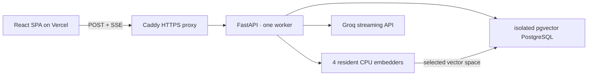

# RAG Playground

A public, inspectable retrieval-augmented chat experience for [Yash Khambhatta's portfolio](https://www.yashx.me). Visitors can compare embedding and generation models while seeing the evidence and timing behind every grounded answer.

## What visitors can inspect

- Four resident CPU embedders: MiniLM L6, BGE Small v1.5, BGE Base v1.5, and Qwen3 Embedding 0.6B.
- Three Groq generation choices: GPT-OSS 20B, GPT-OSS 120B, and Qwen3.6 27B Preview.
- Token-by-token answers streamed as SSE from a POST request using `fetch` and `ReadableStream`.
- Retrieved chunks, cosine scores, requested and served models, fallback state, and per-stage latency.

There are exactly two user controls: the embedding model and the LLM. Retrieval details live in [`config/pipeline.yaml`](config/pipeline.yaml), so future pipeline parameters do not require a new application architecture.

## Architecture



Each chunk row owns four typed columns. The backend maps a validated embedder ID to a fixed SQL identifier; user input never becomes an SQL identifier. Exact cosine scans are intentional for this small corpus: they preserve recall and avoid four HNSW graphs in memory.

## Repository layout

```text
app/                 FastAPI, embedding registry, retrieval, limits, logging, ingestion
config/pipeline.yaml Model registry and retrieval/generation defaults
corpus/              Two curated starter documents from the resume and portfolio
deploy/Caddyfile     Streaming-safe TLS reverse proxy
frontend/            Vite + React + TypeScript SPA
scripts/             Safe ingestion and verification helpers
sql/schema.sql       pgvector schema, four vector columns, logs, daily counters
docker-compose.yml   Isolated production stack
```

## Security and abuse controls

- CORS accepts only explicit HTTPS frontend origins.
- The API and database host ports bind to loopback; only Caddy binds the VPS public IPv4 on ports 80/443.
- The system prompt allows answers only from supplied excerpts and treats the question, history, and corpus as untrusted data.
- Questions are capped at 500 characters and history at six short messages.
- PostgreSQL atomically enforces a salted per-IP daily bucket and a global daily bucket.
- Query logs record selections, retrieved source IDs/scores, latency, fallback attempts, and a salted IP hash. Raw IP addresses are not stored.
- The Groq key and verification token exist only in the VPS `.env`. Neither belongs in the frontend or Vercel.
- The API container drops Linux capabilities, runs as UID 10001, and has a 3,500 MiB hard memory limit.

The private `X-Verify-Fallback` header is for operator verification only. With the server-only token it prepends a deliberately invalid provider model, proving that the live fallback path engages. CORS does not allow browsers to send this header.

## Local checks

```bash
python -m compileall -q app
ruff check app tests
pytest -q
npm --prefix frontend ci
npm --prefix frontend run check
npm --prefix frontend run build
docker compose --env-file .env.example config --quiet
```

The model integration is verified in Docker because all four pinned model revisions must be exercised in the same CPU image used by production.

```bash
docker run --rm --memory=4g --cpus=2.5 \
  -v rag-playground-model-smoke:/models \
  --entrypoint python rag-playground-api:local -m scripts.model_smoke
```

## VPS deployment

Production lives only at `/opt/rag-playground` and uses the Compose project name `rag-playground`.

1. Install Docker Engine and the Compose plugin using the distribution-supported packages if the audited host does not already provide them.
2. Copy this repository to `/opt/rag-playground`.
3. Create `/opt/rag-playground/.env` as mode `600` from `.env.example`. Generate independent random values for the database password, IP hash salt, and verification token.
4. Point the API subdomain's A record at the VPS public IPv4.
5. Start the database, ingest once with no API model process competing for RAM, then start the stack:

```bash
docker compose up -d --wait --wait-timeout 120 db
docker compose run --rm --no-deps api python -m app.ingest --corpus /app/corpus
docker compose up -d
```

For later corpus refreshes, the wrapper prevents two four-model processes from coexisting:

```bash
docker compose stop api
./scripts/ingest.sh
docker compose start api
```

PostgreSQL is reachable from the host only at `127.0.0.1:55432`; the API debug binding is `127.0.0.1:18080`. Caddy binds only the VPS public IPv4 to avoid the audited Tailscale-specific port 443 listener.

## Frontend deployment

The only required browser environment variable is:

```text
VITE_API_URL=https://rag-api.yashx.me
```

Set it for Vercel Production, Preview, and Development. The backend `FRONTEND_ORIGINS` must list the exact Vercel production URL and any configured custom frontend domain. No provider key is ever placed in Vercel.

## API overview

- `GET /v1/health` - database readiness, chunk count, and the exact resident embedder list.
- `GET /v1/config` - public selector metadata and non-sensitive retrieval settings.
- `POST /v1/chat` - validated JSON request; response is `text/event-stream`.

SSE event types are `meta`, `sources`, `model`, `token`, `usage`, `done`, and `error`. A completed response reports both the requested and served model, fallback attempts, and `embeddingMs`, `retrievalMs`, `firstTokenMs`, `generationMs`, and `totalMs`.

One stream can be checked from the production image without exposing the operator token:

```bash
docker compose exec -T api python -m scripts.verify_stream \
  --url http://127.0.0.1:8000 \
  --embedder bge-small \
  --model openai/gpt-oss-20b
```

## Model attribution

- `sentence-transformers/all-MiniLM-L6-v2` - Apache-2.0
- `BAAI/bge-small-en-v1.5` and `BAAI/bge-base-en-v1.5` - MIT
- `Qwen/Qwen3-Embedding-0.6B` - Apache-2.0

All repositories are pinned to immutable Hugging Face commit revisions in the pipeline configuration. Remote model code is disabled and safetensors are required.

## Corpus provenance

The two starter documents are manually curated from Yash's tracked resume and local portfolio source. Stale claims were reconciled: the AIVID internship is dated September 2024 through September 2025, the current email is `yash456k@gmail.com`, and project links use their verified public repositories. Replace or expand these Markdown files, then re-run ingestion.

## License

[MIT](LICENSE)
