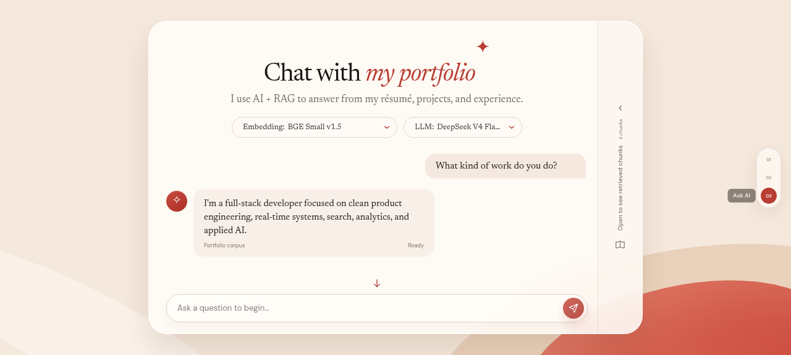
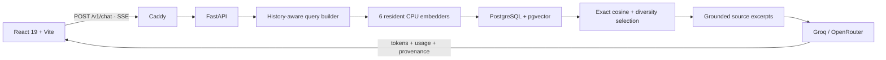

# RAG Playground

**A transparent, multi-model RAG system built into my portfolio.** Visitors can change the embedding model and LLM, stream a grounded answer, and inspect the retrieved evidence, similarity scores, fallbacks, and latency behind it.

[](https://www.yash456k.com/#playground)
[](Dockerfile)
[](frontend/)
[](app/)
[](sql/schema.sql)
[](https://github.com/Yash456k/rag-playground/actions/workflows/ci.yml)
[](LICENSE)

[](https://www.yash456k.com/#playground)

## Why I built it

Most portfolio chatbots hide the interesting part behind a text box. This one exposes the retrieval and generation pipeline so a visitor can answer questions such as:

- Which chunks were retrieved, from which source, and with what cosine score?
- Does a larger embedding model actually retrieve better evidence?
- Which model was requested, which one served the answer, and did fallback engage?
- How much time went to embedding, retrieval, first token, and generation?
- Does a chunking change improve retrieval across every configured embedding route?

The result is both a usable portfolio interface and an inspectable applied-AI system.

## What is live

- **Six CPU embedding routes:** MiniLM L6, BGE Small, BGE Base, Qwen3 Embedding 0.6B, and two portfolio-tuned small models.
- **Five generation routes:** three Groq models plus OpenRouter's free router and DeepSeek V4 Flash.
- **Real SSE streaming:** the browser consumes token events from a POST request with `fetch` and `ReadableStream`.
- **Inspectable retrieval:** source excerpts, cosine scores, selected route, query transform, and retrieval depth.
- **Observable generation:** requested/served model, fallback attempts, token usage, cost estimate, and stage latency.
- **History-aware follow-ups:** recent user turns can expand the retrieval query without being treated as trusted evidence.

## Measured chunking experiment

I replaced the original heading-aware automatic splitter with 20 reviewed semantic chunks, then compared it against the exact 22-chunk baseline across all six embedding routes.

The strongest check was a frozen **22-case post-freeze challenge** using new query forms over the same corpus. Eighteen answerable cases produced 108 paired query/route observations.

| Challenge metric | Automatic | Manual | Paired delta |
|---|---:|---:|---:|
| Required-evidence Recall@5 | 0.866 | **0.968** | **+0.102** |
| Complete evidence retrieved@5 | 0.833 | **0.954** | **+0.120** |
| Mean reciprocal evidence rank@5 | 0.664 | **0.830** | **+0.166** |
| Evidence coverage changes | — | **16 gains / 0 losses** | — |

The paired 95% interval for Recall@5 was **[+0.019, +0.213]**. A more conservative bootstrap that keeps related query variants in shared-fact clusters also remained positive: **[+0.021, +0.221]**.

The result is intentionally not presented as universal RAG generalization: the challenge was frozen after the candidate, but it still queries the same small portfolio corpus. Four of six challenge routes passed the older absolute route gates, and generated-answer evaluation was positive but mixed. The claim is narrower and defensible: **manual semantic boundaries improved this corpus's paired retrieval without a Top-5 evidence-coverage loss.**

- [Readable before/after report](docs/manual-semantic-chunking-evaluation.md)
- [Machine-readable challenge comparison](evaluation/manual-chunking-challenge-v2-rigorous.json)
- [Evaluation design, locks, and limitations](evaluation/README.md)

## Architecture


```mermaid
flowchart LR
    Browser["React 19 + Vite"] -->|"POST /v1/chat · SSE"| Proxy["Caddy"]
    Proxy --> API["FastAPI"]
    API --> Query["History-aware query builder"]
    Query --> Models["6 resident CPU embedders"]
    Models --> DB["PostgreSQL + pgvector"]
    DB --> Select["Exact cosine + diversity selection"]
    Select --> Context["Grounded source excerpts"]
    Context --> LLM["Groq / OpenRouter"]
    LLM -->|"tokens + usage + provenance"| Browser
```

Each corpus row stores six typed vectors. A validated embedder ID maps to a fixed SQL column; user input never becomes an SQL identifier. Exact cosine scans are deliberate for this corpus: they preserve recall and avoid maintaining six approximate-search indexes for a tiny dataset.

Production and evaluation share the same query construction, candidate depth, diversity selector, and source-context formatter. Fresh reports serialize these settings so mismatched runs fail closed instead of producing a misleading comparison.

## Request lifecycle

1. Validate the question, history, embedder, LLM, and retrieval depth.
2. Build the same history-aware retrieval query used by evaluation.
3. Encode it with the selected resident embedder.
4. Retrieve a deeper exact-cosine candidate set from the matching pgvector column.
5. Apply shared diversity selection and minimum-score rules.
6. Format only retrieved source excerpts into an untrusted-data prompt.
7. Stream model, token, usage, and completion events to the browser.
8. Record latency, selected sources, fallback attempts, and a salted IP hash.

## Engineering choices

| Concern | Implementation |
|---|---|
| Retrieval | Exact cosine, configurable Top-K, deeper candidate pool, shared diversity selection |
| Embeddings | Six pinned routes, immutable remote revisions, safetensors only, remote code disabled |
| Generation | Groq and OpenRouter behind one streaming interface with bounded fallback |
| Storage | PostgreSQL 16 + pgvector, one typed vector column per embedding space |
| Evaluation | Locked splits, semantic qrels, paired bootstrap intervals, exact sign tests, regression lists |
| Runtime | Docker Compose, one API worker, resident CPU models, loopback-only API/database |
| Frontend | React 19, TypeScript, Vite, streamed Markdown answers, inspectable evidence drawer |
| Abuse control | Atomic per-IP/global limits and a model-weighted monthly OpenRouter budget |

## Repository map

```text
app/          FastAPI, retrieval, streaming, ingestion, limits, and logging
frontend/     React + TypeScript portfolio and Ask AI interface
config/       Embedding, generation, chunking, and retrieval configuration
corpus/       Curated résumé, project, and engineering case-study sources
evaluation/   Locked cases, qrels, gates, and generated comparison reports
scripts/      Evaluation, ingestion, verification, and deployment helpers
sql/          pgvector schema and operational tables
training/     Reviewed datasets, pinned fine-tuning recipes, and artifact audits
```

## Run the interface locally

The frontend development server proxies `/api` to the live public API by default, so the UI can be explored without downloading six embedding models:

```bash
git clone https://github.com/Yash456k/rag-playground.git
cd rag-playground/frontend
npm ci
VITE_API_URL=/api npm run dev
```

Open `http://localhost:5173`. Public API rate limits still apply.

## Run the full stack

The complete backend requires Docker, the two reviewed local embedding artifacts under `model-artifacts/`, and server-side provider keys. Start from `.env.example`, replace every placeholder, and never commit `.env`.

```bash
docker compose build api
docker compose up -d --wait db
docker compose run --rm --no-deps api python -m app.ingest --corpus /app/corpus
docker compose up -d api
```

The API binds to `127.0.0.1:18080` and PostgreSQL to `127.0.0.1:55432`. Caddy is the only public production entry point.

## Portfolio activity refresh on Hermes

The daily `portfolio-activity-sync.timer` writes a public, allowlisted cache without
commits or frontend deployments. Install its units with
`scripts/install-activity-sync-hermes.sh`. The Hermes service runs in the existing
Hermes Python environment and uses `ACTIVITY_CODEX_AUTH_SOURCE=hermes` to resolve
its current Codex login through the shared, refresh-aware credential pool. The
original Codex auth file supplies the expected account ID; a different account
fails closed. Credentials stay on the server and are never copied into the cache.
Outside Hermes, the collector defaults to the existing Codex auth-file behavior.
Failed service runs retry after five minutes, with at most three starts per hour;
the nightly schedule remains 23:55 Asia/Kolkata. Check the service journal and the
cache's `generatedAt` when diagnosing stale activity.

## Checks

```bash
pytest -q
ruff check .
npm --prefix frontend ci
npm --prefix frontend run check
npm --prefix frontend run build
docker compose --env-file .env.example config --quiet
```

The rigorous evaluation adds strict pairing, row-integrity failures, retrieval-protocol parity, prompt-budget accounting, deterministic report generation, answer-run exclusions, and shared-fact sensitivity tests.

## API

| Endpoint | Purpose |
|---|---|
| `GET /v1/health` | Database readiness, chunk count, and loaded embedder inventory |
| `GET /v1/config` | Public model/retrieval configuration without secrets |
| `POST /v1/chat` | Validated chat request returning `text/event-stream` |

SSE events are `meta`, `sources`, `model`, `token`, `usage`, `done`, and `error`.

## Security and cost controls

- Provider keys and verification tokens stay server-side.
- CORS accepts only explicit HTTPS frontend origins.
- API and database host ports bind to loopback.
- The API container runs as UID 10001 with dropped capabilities and `no-new-privileges`.
- Questions and history are bounded before prompt construction.
- Corpus, history, and questions are treated as untrusted data, not instructions.
- PostgreSQL atomically enforces per-IP, global daily, and model-weighted monthly limits.
- Logs store a salted IP hash rather than the raw address.

## Further reading

- [RAG from first principles, using this system](RAG_GUIDE.md)
- [Manual semantic chunking: rigorous before/after evaluation](docs/manual-semantic-chunking-evaluation.md)
- [Evaluation suite and reproducibility notes](evaluation/README.md)
- [Implementation and deployment record](PROGRESS.md)

## License

[MIT](LICENSE)
